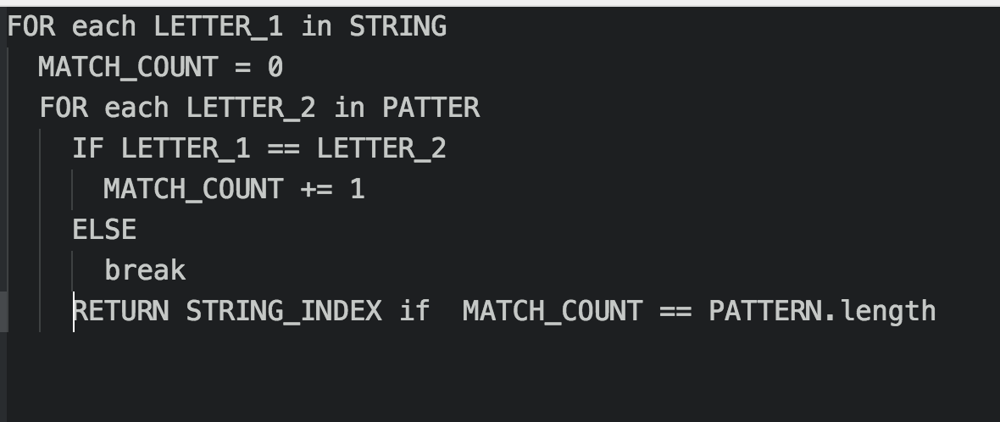

<!--
Creator: Alex White
Market: SF
-->

# Big O and optimization with String Pattern Matching Part 1

### Why is this important?
*This workshop is important because:*

- Big O notation is a common way to describe the efficiency of an algorithm.
- It is an important concept in Computer Science
- It is a common concept in interviews
- Every programmer need to be able to think about optimization
- We use string matching algorithms every day

### What are the objectives?
*After this workshop, developers will be able to:*

- Analyze the *time* Big O of various algorithms
- Implement a Brute Force solution to the string matching problem
- Think about performance optimization

### Where should we be now?
*Before this workshop, developers should already be able to:*

- Write algorithms to solve simple problems
- Pseudo Code

## String Matching

### Ever wonder how your browser's `Command F` search works?

It works by using a **string matching** algorithm. Your browser treats all of the
text in the DOM as one long string, and looks for some pattern in that string.
When it finds the pattern it stores the `index` of each instance of the pattern,
and uses DOM manipulation to highlight each instance of the pattern.

Underneath this lies an algorithm that searches through the text looking for the pattern.

How might that work?

#### Brute Force

A brute force algorithm is one that has **no** optimization at all. It leans heavily on the
computer to find a solution, rather than being intelligent about how to conserve resources.

Typically a brute force algorithm can be characterized as **checking every possibility**.

***
`In computer science, brute-force search or exhaustive search, also known as generate and test, is a very general problem-solving technique that consists of systematically enumerating all possible candidates for the solution and checking whether each candidate satisfies the problem's statement.`

`- wikipedia`
***

For example, you may have heard of a **brute force** attack used to crack someone's password. This
would mean trying every possible combination until you get one right.

#### Brain Storm

Discuss with your table for a few minutes what a brute force solution to string matching would look like.
Then in pairs, take 10 minutes to write some pseudo code.

  
Pseudo Code for String Matching Brute Force

  

#### Big O Notation

`Big O notation is used in Computer Science to describe the performance or complexity of an algorithm. Big O specifically describes the worst-case scenario, and can be used to describe the execution time required or the space used (e.g. in memory or on disk) by an algorithm.`

`-Rob Bell, A beginner's guide to Big O notation`

#### What is worst case scenario?

For a given algorithm, the worst case scenario is the a scenario that requires the maximum computations possible.

For brute force string matching, this would be any pattern that is not found in the string.

In this case we would check every letter in our pattern against every letter in the string until we get to the end.

Big O considers what happens as the size of our variables increases. What happens as our string gets bigger? What about as our pattern gets bigger? Take a couple of minutes to think about what big O of our brute force algorithm is.

## Closing Thoughts
- Big O notation looks at the efficiency of an algorithm in its worst case scenario
- Brute force is a way to solve a problem algorithmically with no regard for efficiency
- We can optimize our algorithm to do better than brute force

## Additional Resources
- [Rob Bell, A beginner's guide to Big O notation](https://rob-bell.net/2009/06/a-beginners-guide-to-big-o-notation/)
